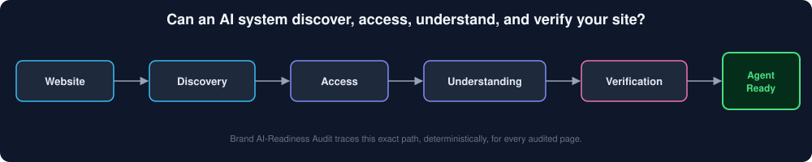
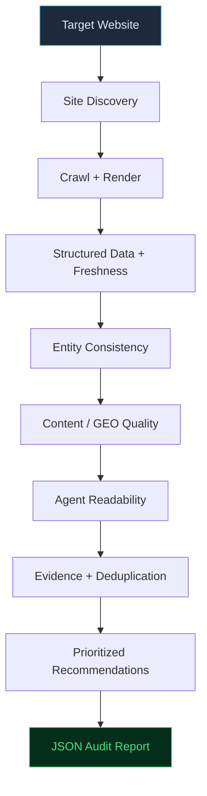
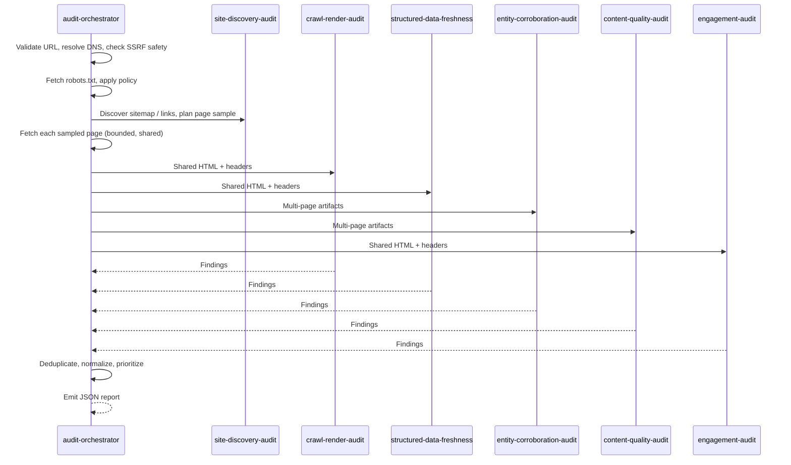
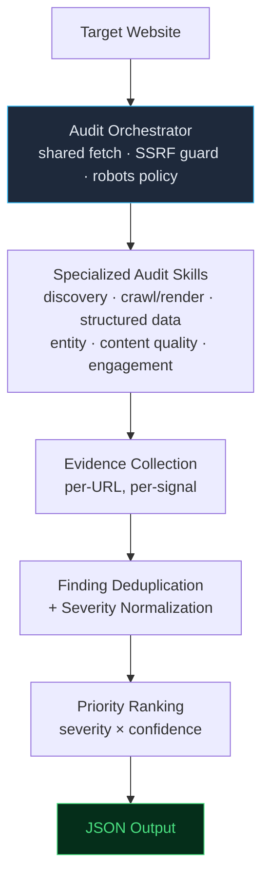
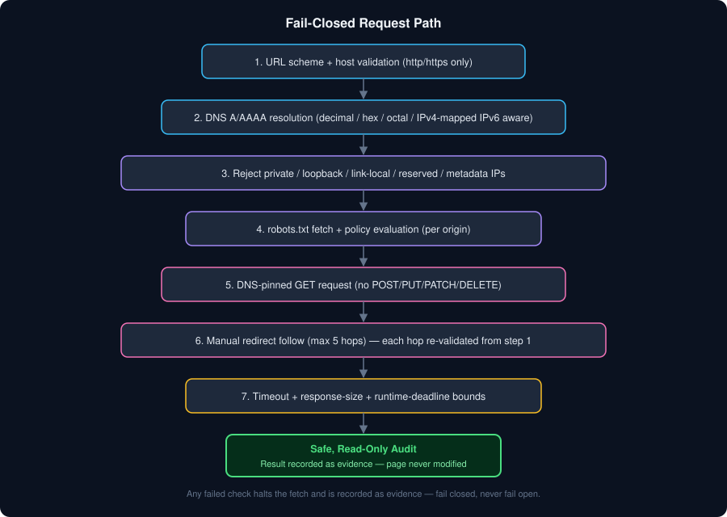
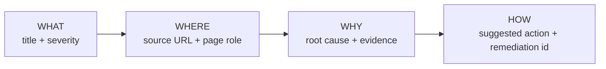

<div align="center">

# Brand AI-Readiness Audit

### Is your website ready for AI?

> Audit whether AI systems can **discover, access, read, understand, extract, verify, and use** the important information on a website — deterministically, read-only, without touching a single byte of the live site.

[View the project on GitHub](https://github.com/pratyushsri1909/brand-ai-readiness-audit)


</div>

<p align="center">
  
</p>

An Agent Skill Marketplace submission for the **Adobe University Hackathon 2026**. It audits how ready a website is for autonomous AI readers — deterministic, read-only, evidence-backed at every finding, built to generalize to sites it has never seen, and it closes with a prioritized, mechanism-based list of what to fix first.

---

## Table of Contents

1. [The Problem](#1-the-problem)
2. [The Solution](#2-the-solution)
3. [What the Auditor Checks](#3-what-the-auditor-checks)
4. [How It Works](#4-how-it-works)
5. [Architecture](#5-architecture)
6. [Skill Architecture](#6-skill-architecture)
7. [Security by Design](#7-security-by-design)
8. [Evidence-Backed Findings](#8-evidence-backed-findings)
9. [Output Schema](#9-output-schema)
10. [Running It](#10-running-it)
11. [Testing & Validation](#11-testing--validation)
12. [Limitations](#12-limitations)

---

## 1. The Problem

Traditional website optimization asks whether a human can find and use a page. AI systems and web agents ask a stricter, less forgiving version of the same question: **can an automated reader get in the door at all, and if it does, can it trust what it finds?** 

A single `robots.txt` misconfiguration, a JavaScript-only render, or an absent schema tag can make an otherwise strong website effectively invisible to the systems now standing between a brand and its audience.

| Challenge | What Goes Wrong | AI / Agent Impact |
|---|---|---|
| **Crawler restrictions** | `robots.txt` blocks, or ambiguous 403/5xx responses on the robots endpoint itself | The agent halts before reaching the page — no content is ever seen |
| **JavaScript-only content** | Critical content exists only after client-side hydration | An agent reading raw HTML sees an empty shell instead of real content |
| **Missing structured data** | No JSON-LD, malformed schema, or facts locked inside images/infographics | Facts can't be parsed reliably; the agent must guess instead of extract |
| **Stale information** | `datePublished`/`dateModified`/`Last-Modified` far older than the content implies | The agent may cite outdated facts with unwarranted confidence |
| **Entity inconsistency** | Organization identity or product pricing conflicts across pages | The agent can't corroborate who the brand is or what things cost |
| **Thin / duplicate content** | Near-identical pages, boilerplate-only pages, missing meta descriptions | The agent can't tell which page is authoritative or worth extracting |
| **Poor navigation** | Missing/duplicate H1s, no clear CTA, broken canonical tags | The agent loses orientation and can't identify the page's purpose or next action |

This project treats machine usability as a measurable engineering property, distinct from human usability, and scores it the same way for every website — with no hardcoded assumptions about what that website is.

---

## 2. The Solution

**Brand AI-Readiness Audit** is a deterministic, read-only Agent Skill Marketplace that audits whether a website is discoverable, crawlable, machine-readable, understandable, verifiable, fresh, consistent, and usable by AI systems and web agents.

It is deliberately **not**:
- an SEO checker
- a generic website crawler
- an LLM wrapper that "reads and summarizes" a page
- a ranking or traffic predictor

Instead, it measures the technical readiness signals that determine whether an automated system can discover, access, interpret, verify, and act on a website's information — the mechanics an AI reader depends on, independent of search-ranking outcomes.

Every property below is a real, code-level design constraint of this system:

- **Deterministic** — identical inputs always produce identical findings; no LLM calls, no randomness. Crawling and page selection are bounded and deterministic.
- **Read-only, recommend-only** — the audit performs read-only retrieval and browser rendering. Browser network interception permits only safe read methods (GET/HEAD) and blocks state-changing HTTP methods.
- **Bounded** — hard limits on pages, depth, bytes, redirects, and wall-clock runtime, so every audit terminates.
- **Evidence-driven** — every finding cites the exact URL and observed signal that produced it.
- **Built for unseen websites** — no hardcoded domains; page-role classification and thresholds are pattern-based and generalize to arbitrary sites.
- **Standard Library Core** — core audit logic runs on Python's standard library; optional browser rendering uses Playwright when available. No calls to external LLMs or third-party APIs.



---

## 3. What the Auditor Checks

| Dimension | Checks |
|---|---|
| **Discovery** | `robots.txt` sitemap directives, sitemap index/urlset traversal, homepage link-topology fallback, URL normalization and role classification |
| **Crawlability** | HTTP reachability, robots policy compliance, redirect-scope and robots re-evaluation per hop, crawl-trap suppression, depth ceiling |
| **Rendering** | Raw HTML readability, meta-robots/`X-Robots-Tag` directives, conservative SPA/hydration inference, optional Playwright render comparison |
| **Structured Data** | JSON-LD validity and robustness (including `@graph`/array flattening), Product/Offer commerce signal detection, schema disambiguation (`@id`/`sameAs`) |
| **Freshness** | `datePublished`/`dateModified`, OpenGraph metadata, HTTP `Last-Modified` vs. configured staleness thresholds |
| **Entities** | Cross-page Organization identity consistency, product price corroboration, AMBIGUOUS vs. CONFLICTING disambiguation for multi-brand sites |
| **Content** | Page-role-aware thin-content thresholds, exact duplicates (SHA-256), near-duplicates (shingle Jaccard ≥ 0.85), topic overlap, meta description quality |
| **Agent Readability** | Title/H1 orientation, heading hierarchy, canonical link integrity, paragraph scannability, internal navigation, word-bounded CTA/next-action detection |

---

## 4. How It Works

### Step 1 — Site Discovery
`site-discovery-audit` reads `robots.txt` for declared `Sitemap:` directives, recursively traverses sitemap indexes and urlsets (bounded to 10 documents, depth 3, 2 MB per response, 100 discovered URLs), and falls back to homepage `<a href>` extraction when no sitemap exists. Candidate URLs are normalized (lowercased scheme/host, tracking params like `utm_*` stripped, relative paths resolved) and classified into roles — Homepage, About, Product/Service, Contact, Category, Article — using deterministic pattern matching. An ambiguous role is never guessed.

### Step 2 — Crawl & Render
`audit-orchestrator` performs the single shared network fetch per URL, so no detector re-crawls the same page. `crawl-render-audit` then evaluates HTTP status, robots compliance, and meta-robots/`X-Robots-Tag` conflicts, and measures readable text against conservative SPA/hydration signals — labeling static-JS inference as exactly that, never fabricating a rendered DOM.

### Step 3 — Structured Data & Freshness
`structured-data-freshness` parses every JSON-LD block with per-block error isolation (one malformed script can't suppress valid data elsewhere), flattens `@graph`/array structures, detects commerce context from overlapping price/CTA/product signals rather than a currency symbol alone, and checks freshness timestamps against configured thresholds.

### Step 4 — Entity Consistency
`entity-corroboration-audit` groups Organization declarations by `@id`/normalized URL across sampled pages, flags **CONFLICTING** only when the same identity declares contradictory names, and treats distinct organizations without a shared identity key as **AMBIGUOUS** — protecting legitimate multi-brand sites from false positives. Product prices are cross-referenced the same conservative way.

### Step 5 — Content / GEO Quality
`content-quality-audit` applies page-role-sensitive word-count thresholds (article: 250, product: 80, homepage/category: 50, general: 100), SHA-256 exact-duplicate detection, character-shingle Jaccard near-duplicate detection (≥ 0.85), term-based topic-overlap detection (≥ 0.70, labeled "Potential Topic Overlap," never "keyword cannibalization"), and meta description completeness.

### Step 6 — Agent Readability
`engagement-audit` parses actual heading elements (not CSS classes that merely say "h1"), validates canonical tags, classifies page intent from path/schema/heading/commerce signals, flags multiple H1s and unbroken paragraphs over 800 characters, and detects CTA/next-action language in both HTML attributes and visible inner text using word-boundary matching.

### Step 7 — Findings
The orchestrator deduplicates equivalent findings, normalizes severities, enriches each with root cause, expected mechanism, and priority score, and emits the final, sorted report.



---

## 5. Architecture



The orchestrator (`skills/audit-orchestrator`) owns the **single shared network fetch** per page: it validates the URL, resolves DNS, checks SSRF safety, evaluates `robots.txt`, and fetches the page exactly once. The resulting HTML, headers, and metadata are passed by reference to each detector skill, so a site is never redundantly crawled by six separate modules. Each detector returns raw findings; the orchestrator enriches, deduplicates, prioritizes, and emits one deterministic report. This shared-fetch design is the core engineering decision behind the system's speed and its safety guarantees — every fetch, and only that fetch, is subject to the security checks in Section 7.

---

## 6. Skill Architecture

The marketplace (`marketplace.json`) declares **one entrypoint and six focused detector skills** — seven total.

| Skill | Responsibility | Output |
|---|---|---|
| **`audit-orchestrator`** *(entrypoint)* | Bounded shared fetch, SSRF/DNS safety, robots enforcement, redirect-chain revalidation, detector composition, deduplication, severity normalization, CLI | Final JSON audit report |
| `site-discovery-audit` | Sitemap/robots discovery, URL normalization, role classification, budgeted page-plan assembly | Typed page plan + discovery findings |
| `crawl-render-audit` | HTTP reachability, robots/meta-robots compliance, raw readability, static JS-render inference | Crawlability & rendering findings |
| `structured-data-freshness` | JSON-LD parsing/robustness, commerce signal detection, freshness checks, entity disambiguation | Structured-data & freshness findings |
| `entity-corroboration-audit` | Cross-page Organization identity + product price corroboration (on-site only, zero external lookups) | Identity/pricing consistency findings |
| `content-quality-audit` | Thin content, exact/near-duplicate, topic overlap, meta description checks | Content quality findings |
| `engagement-audit` | Title/H1 orientation, canonical integrity, scannability, navigation, CTA detection | Agent-readability findings |

`audit-orchestrator` is the **sole external entrypoint** — the only skill meant to receive the audit request directly. Every other skill operates strictly on artifacts the orchestrator hands it, never on the raw request, and is never invoked directly by an end user. This keeps crawling centralized in one place instead of duplicated six times.

---

## 7. Security by Design

**The auditor analyzes websites. It does not modify them.**

<p align="center">
  
</p>

Every network request in this system passes through the same fail-closed path, whether it is the initial fetch or the fifth hop of a redirect chain:

- **HTTP(S)-only, safe read methods only (GET/HEAD).** State-changing HTTP methods (POST, PUT, PATCH, DELETE, CONNECT, TRACE, and others) are blocked across both direct network fetches and browser network interception. No authentication, CAPTCHA, or WAF bypass is attempted anywhere in the codebase.
- **DNS-based SSRF protection.** Hostnames are resolved to A/AAAA addresses and checked against `ipaddress`-level predicates: loopback, link-local, private (RFC 1918/4193), reserved, multicast, unspecified, and other non-global ranges are all rejected — including cloud metadata endpoints such as `169.254.169.254`.
- **Alternate IP-representation handling.** Hostnames disguised as decimal (`2130706433`), hex (`0x7f000001`), octal (`0177.0.0.1`), or IPv4-mapped IPv6 (`::ffff:127.0.0.1`) are decoded and validated the same way as plain dotted-quad addresses, reducing (not eliminating) the surface for DNS-rebinding-style tricks.
- **Connections are DNS-pinned** to the validated IP after resolution, closing the gap between the hostname that was checked and the hostname the process actually connects to.
- **`robots.txt` is evaluated before the target page is ever fetched.** A 404 is treated as "no rules published"; 403, 429, 5xx responses, and timeouts are all treated as unsafe-to-crawl and halt the fetch — fail closed, not fail open.
- **Manual redirect handling.** Automatic redirects are disabled; the orchestrator follows up to 5 hops itself, re-running DNS/SSRF/robots validation against every redirect target's origin before following it — including cross-origin hops — and reports the final resolved host.
- **Hard bounds throughout:** response size (5 MB/page), page count (20 default / 50 ceiling), crawl depth (3), sitemap size (2 MB) and count (10 documents), and a global wall-clock deadline (240s) enforced via `time.monotonic()` across every request, retry, and politeness delay.
- **No external entity resolution.** Entity and pricing corroboration is strictly on-site and deterministic; no `sameAs` URL is ever fetched externally.
- **Optional browser rendering** (Playwright escalation, when available) is gated by the same security, scope, robots, and deadline checks as the plain HTTP path — it does not bypass them.
- **Fail-closed by default.** Unexpected validation errors default to access denied, not access permitted.

These are concrete, testable constraints, not a claim of invulnerability — the goal is a bounded, auditable request path, not an unbreakable one.

---

## 8. Evidence-Backed Findings

Every finding is built around four questions:



This is a real finding shape, taken directly from the orchestrator's enrichment logic (illustrative values shown):

```json
{
  "id": "F-001",
  "title": "Unable to Verify robots.txt Safety",
  "severity": "high",
  "evidence": "robots.txt at https://example.com/robots.txt could not be safely verified (HTTP 403); the target page was not fetched.",
  "suggested_action": {
    "summary": "Restore a reachable robots.txt endpoint returning 200 or 404 so crawler permissions can be verified deterministically.",
    "priority": "high"
  },
  "rule_id": "CR-ROBOTS-003",
  "root_cause": "The robots.txt verification failed directly due to a http error 403.",
  "expected_mechanism": "Resolve the http error 403 so that the robots.txt endpoint can be safely verified by crawlers.",
  "impact": "high",
  "effort": "easy",
  "target_persona": "developer",
  "confidence": "measured",
  "remediation_id": "REM-ROB-003",
  "priority_score": 3.0,
  "provenance": {
    "source_url": "https://example.com",
    "detector": "audit-orchestrator",
    "page_role": "general",
    "timestamp": "2026-09-12T10:33:15Z"
  }
}
```

Every finding is traceable to a `rule_id` in a central rule registry, carries a `confidence` label (`measured` vs. `inferred` vs. `uncertain`), and a `priority_score` derived deterministically from `severity × confidence` — never from an opaque model judgment. Recommendations are mechanism-based fixes, not generic AI-generated advice.

---

## 9. Output Schema

The entrypoint always emits the contest **floor schema** — `site`, `audited_at`, `summary`, `findings[]` — and, in enhanced mode (the default), several additional sections:

| Section | Purpose |
|---|---|
| `coverage` / `evidence_coverage` | Granular discovery counters — links seen, sitemap URLs seen, enqueued, selected, fetched, skipped, failed, budget, stopping condition |
| `readiness_band` | A deterministic heuristic label — `Strong`, `Developing`, `Needs Work`, or `Inconclusive` — derived purely from severity counts, never from external ranking data |
| `executive_summary` | Sample-aware, human-readable synthesis of what was audited and found |
| `proactive_recommendations` | Targeted improvement opportunities, without fabricated metrics or ranking guarantees |

> `readiness_band` is explicit about what it is *not*: a deterministic heuristic classification based on observed findings in the sampled pages — not an external search-engine benchmark, and not a guarantee of AI visibility.

---

## 10. Running It

From the marketplace root:

```bash
python skills/audit-orchestrator/scripts/run_audit.py https://example.com
```

Optional flags:

| Flag | Effect |
|---|---|
| `--max-pages <N>` | Page crawl budget (default: 20, hard ceiling: 50) |
| `--floor` | Emit only the minimal 4-key contest floor schema |
| `--help` / `-h` | Show CLI usage |

The command writes only the final JSON report to `stdout`. Invalid input and pipeline errors are reported as JSON on `stderr` with a non-zero exit code — nothing is silently swallowed.

Source: [github.com/pratyushsri1909/brand-ai-readiness-audit](https://github.com/pratyushsri1909/brand-ai-readiness-audit)

---

## 11. Testing & Validation

| Suite | Result |
|---|---|
| Unit + integration test suite (`tests/`) | **387 tests passing** |
| Marketplace manifest validator (`scripts/validate_marketplace.py`) | **Passed** — exactly one entrypoint, no duplicate skill IDs |
| Synthetic/adversarial blind benchmark (`tests/run_blind_generalization_eval.py`) | **21/21 cases passed** — 13 true positives, 0 false positives, 0 false negatives (100% precision, 100% recall, 0% false-positive rate) |
| Generalization regression matrix (`tests/test_unseen_generalization_matrix.py`) | **20/20 archetypes passed** — full fixture regression suite |

The 21-case blind benchmark is a synthetic/adversarial set exercising deliberately varied unseen-like site structures — clean multi-page SaaS sites, non-English stores, SPA shells requiring browser-render recovery, soft-blocked/challenge responses, conflicting cross-page pricing, broken JSON-LD syntax, and multi-hop redirect chains — scored against a hand-authored ground truth, where any unpredicted finding counts as a false positive and any missed defect counts as a false negative. The 20-case regression matrix is a separate fixture suite used to confirm the same behavior holds across an independent set of site archetypes.

> These are synthetic/adversarial benchmark results. They demonstrate robustness across deliberately varied unseen-like site structures; they do not, by themselves, establish accuracy on arbitrary real-world domains.

---

## 12. Limitations

- **Sampling, not exhaustive crawling.** The auditor inspects a bounded, representative sample of pages (default 20, hard ceiling 50) rather than every URL on a site.
- **No guarantee of AI ranking or citation.** This tool measures technical readiness signals — crawlability, structured data, freshness, consistency, readability. It does not and cannot guarantee inclusion, ranking, or citation by any specific AI system, search engine, or answer engine.
- **Static JS-render inference is inference, not execution**, unless the optional browser-render path is used — and even then, results are labeled by confidence rather than overstated as certainty.
- **Entity and pricing corroboration is strictly on-site.** No external `sameAs` resolution or third-party verification is performed.
- **Deterministic heuristics, not a trained model.** `readiness_band` and severity classification are formula-driven from observed findings; they are not benchmarked against real-world AI search outcomes.